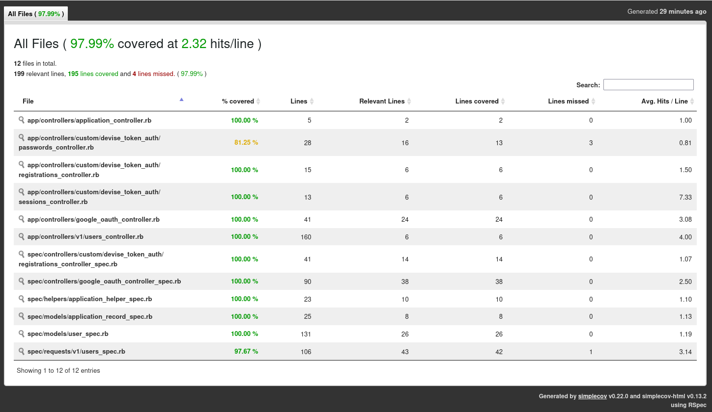

# README.md

# api

## 🚀 Requisitos previos

Antes de comenzar, asegúrate de tener instalados y estas usando los siguientes componentes:

  - **Ruby:** versión `3.1.3`
  - **Rails:** versión `7.2.2.1`

## 🛠️ Instalación y configuración

Sigue estos pasos para poner en marcha la aplicación:

1.  **Instala las dependencias de Rails:**

    ```bash
    bundle install
    ```

2.  **Configura las variables de entorno:**

    Este proyecto utiliza `dotenv-rails` para gestionar las variables de entorno. Crea un archivo `.env` en la raíz del proyecto y añade las configuraciones necesarias, para el front se usa REACT+VITE, por ejemplo:

    ```bash
    GOOGLE_CLIENT_ID=123
    GOOGLE_CLIENT_SECRET=123
    FRONTEND_URL=http://localhost:5173

    ```

    Asegúrate de que este archivo **no** se suba al control de versiones.

3.  **Configura la base de datos:**

    ```bash
    rails db:create
    rails db:migrate
    ```


## 🏃 Arrancando la aplicación

Para iniciar el servidor de desarrollo de Rails, ejecuta el siguiente comando:

```bash
rails s
```

La aplicación estará disponible en [http://localhost:3000](https://www.google.com/search?q=http://localhost:3000).

## 💎 Gemas utilizadas y su propósito

Este proyecto utiliza una serie de gemas para facilitar el desarrollo, las pruebas y la seguridad. Aquí te explico para qué sirve cada una:

### ⚙️ Gemas de desarrollo y pruebas

  - `byebug`: Un **debugger** simple y potente para Ruby. Esencial para inspeccionar el flujo de tu código y encontrar errores.
  - `factory_bot_rails`: Proporciona una forma limpia y eficiente de **crear datos de prueba** (`factories`) en lugar de usar `fixtures`.
  - `faker`: Genera **datos de prueba falsos** (nombres, emails, direcciones) de manera realista para tus `factories` y `seeds`.
  - `letter_opener_web`: Permite **ver los correos electrónicos** que se envían desde la aplicación directamente en el navegador, sin necesidad de un servidor de correo real.
  - `rspec-rails`: El popular **framework de pruebas BDD** (Behavior-Driven Development) para Ruby on Rails.
  - `simplecov`: Genera **reportes de cobertura de código** para tus pruebas, ayudándote a saber qué partes de tu código están siendo probadas.
  - `annotaterb`: **Añade comentarios** en la parte superior de los archivos de modelos, controladores y `factories` para documentar sus atributos y asociaciones.
  - `dotenv-rails`: Carga variables de entorno desde un archivo `.env` en el entorno de desarrollo, manteniendo tus **claves y configuraciones sensibles fuera del repositorio**.
  - `rubocop`: Es un **linter y formateador de código** que asegura que el código siga las guías de estilo de Ruby, promoviendo la consistencia y la legibilidad. Las gemas `rubocop-performance`, `rubocop-rails` y `rubocop-rspec` extienden sus reglas para un mejor análisis.

### 🧪 Gemas de pruebas

  - `database_cleaner-active_record`: Se utiliza para **limpiar la base de datos** entre cada suite de pruebas, garantizando que los resultados sean consistentes e independientes.
  - `shoulda-matchers`: Proporciona **matchers de RSpec** de una sola línea para probar las funcionalidades comunes de Rails, como las validaciones de modelos y las asociaciones.

### 🔒 Gemas de autenticación y seguridad

  - `rack-cors`: Habilita el **intercambio de recursos de origen cruzado** (`CORS`), permitiendo que clientes externos (como aplicaciones frontend) hagan peticiones a tu API de Rails.
  - `devise`: Una **solución de autenticación completa** y flexible para Rails, con soporte para registro de usuarios, inicio y cierre de sesión, y recuperación de contraseñas.
      - `:confirmable`: **Confirma la dirección de correo electrónico** del usuario después de registrarse. Esto ayuda a prevenir registros con correos falsos y asegura que el usuario sea el dueño de la cuenta.
      - `:lockable`: **Bloquea la cuenta** del usuario después de una cantidad de intentos de inicio de sesión fallidos, protegiendo contra ataques de fuerza bruta. Puede ser desbloqueada manualmente o por un correo electrónico de desbloqueo.
      - `:timeoutable`: **Cierra la sesión del usuario automáticamente** después de un período de inactividad, lo que es crucial para la seguridad en sesiones de larga duración.
      - `:trackable`: **Rastrea la actividad de inicio de sesión** del usuario, como la cantidad de inicios de sesión, la última vez que inició sesión y la dirección IP.
  - `devise_token_auth`: Una extensión de `devise` que implementa la **autenticación basada en tokens**, ideal para construir APIs que serán consumidas por aplicaciones SPA o móviles.
  - `google-id-token`: Facilita la **verificación de tokens JWT** emitidos por Google, permitiendo implementar la autenticación de usuarios a través de Google.

## ✅ Pruebas y calidad de código

Para asegurar la calidad del código, el proyecto cuenta con un conjunto robusto de pruebas y un linter. A continuación, se muestran los resultados de la última ejecución:

### **Pruebas (RSpec)**

```bash
bundle exec rspec
......................................

Finished in 1.54 seconds (files took 1.89 seconds to load)
38 examples, 0 failures

Coverage report generated for RSpec to /home/elorat/trader-daniel/sites/cube/api/coverage.
Line Coverage: 97.99% (195 / 199)
```

### **Análisis de código (RuboCop)**

```bash
bundle exec rubocop
Inspecting 47 files
...............................................

47 files inspected, no offenses detected
```

Para ver el coverage con en vscode con el plugins liveServer:

http://127.0.0.1:5500/api/coverage/index.html#_AllFiles

